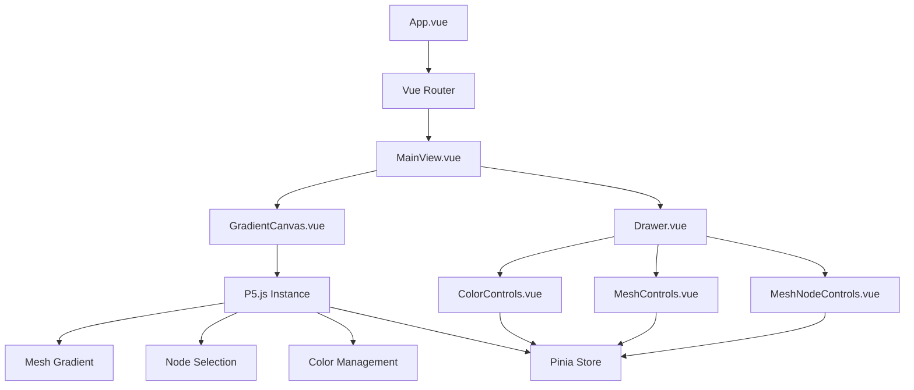

# 🌈 Vue-P5js-Gradient-App

A beautiful, interactive gradient mesh visualization application built with Vue.js and P5.js. Create mesmerizing, customizable gradient patterns by adjusting mesh nodes, colors, and grid density.


## ✨ Features

- 🖼️ **Full-Screen Gradient Visualization** - Smooth, beautiful gradient meshes that fill your browser window
- 🎨 **Mesh Node Customization** - Select and edit individual nodes in the mesh grid
- 🎯 **Draggable Nodes** - Reposition mesh nodes to create custom gradient shapes
- 🔍 **Configurable Mesh Density** - Adjust the number of rows and columns in the mesh grid
- 👁️ **Mesh Visibility Toggle** - Show or hide the mesh grid and nodes
- 📱 **Responsive Design** - Works beautifully on any device or screen size
- 🧩 **Intuitive UI** - Minimalist interface with a sliding drawer for controls
- ⚡ **WebGL Acceleration** - Hardware-accelerated rendering for smooth performance

## 🛠️ Tech Stack

- **[Vue.js 3](https://vuejs.org/)** - Progressive JavaScript framework with Composition API
- **[P5.js](https://p5js.org/)** - Creative coding library for graphics and animations
- **[Pinia](https://pinia.vuejs.org/)** - Intuitive, type safe state management
- **[Vue Router](https://router.vuejs.org/)** - Official router for Vue.js
- **[Material UI](https://mui.com/)** - Component library for consistent UI design
- **[Vite](https://vitejs.dev/)** - Next generation frontend tooling

## 🚀 Getting Started

### Prerequisites

- Node.js (v16+)
- npm (v7+) or yarn (v1.22+)

### Installation

1. Clone the repository
```sh
git clone https://github.com/yourusername/Vue-P5js-Gradient-App.git
cd Vue-P5js-Gradient-App
```

2. Install dependencies
```sh
npm install
# or
yarn install
```

3. Start the development server
```sh
npm run dev
# or
yarn dev
```

4. Open your browser and navigate to `http://localhost:5173`

## 🎮 How to Use

1. **View the Gradient**: When you first open the app, you'll see a full-screen gradient mesh visualization
2. **Open the Controls**: Click the drawer handle on the right side of the screen to open the control panel
3. **Adjust Mesh Density**: Use the row and column inputs to change the mesh grid density
4. **Select Nodes**: Click on any node in the mesh to select it
5. **Edit Node Colors**: Use the color picker to change the color of the selected node
6. **Reposition Nodes**: Drag nodes to create custom gradient shapes
7. **Toggle Mesh Visibility**: Use the checkbox to show or hide the mesh grid and nodes

## 🧪 Development

### Project Structure

```
src/
├── assets/          # Static assets
├── components/      # Vue components
│   ├── ui/          # Generic UI components
│   └── gradient/    # Gradient-specific components
├── composables/     # Reusable composition functions
├── router/          # Vue Router configuration
├── stores/          # Pinia stores
│   └── gradient.ts  # Gradient and mesh configuration store
├── views/           # Page components
└── App.vue          # Root component
```

### Available Scripts

- `npm run dev` - Start the development server
- `npm run build` - Build for production
- `npm run preview` - Preview the production build
- `npm run test:unit` - Run unit tests
- `npm run test:e2e` - Run end-to-end tests
- `npm run lint` - Lint the codebase

## 🧩 Architecture

The application follows a component-based architecture with a clear separation of concerns:



## 🔍 Key Technical Features

- **P5.js Integration**: Uses P5.js in instance mode for better encapsulation within Vue components
- **Reactive State Management**: Pinia store for managing gradient and mesh settings
- **Mesh Gradient Implementation**: Grid-based approach with configurable rows and columns
- **Bilinear Interpolation**: Smooth color transitions between mesh nodes
- **WebGL Rendering**: Hardware acceleration for better performance
- **Responsive Canvas**: Automatically resizes to fit any screen size
- **Touch Support**: Mobile-friendly interactions for node selection and dragging
- **Computed Node Grid**: Efficient node lookup for improved performance

## 📝 License

This project is licensed under the MIT License - see the LICENSE file for details.

## 🙏 Acknowledgements

- [Vue.js](https://vuejs.org/) - The Progressive JavaScript Framework
- [P5.js](https://p5js.org/) - JavaScript library for creative coding
- [Pinia](https://pinia.vuejs.org/) - The Vue Store that you will enjoy using
- [Material UI](https://mui.com/) - React components for faster and easier web development

## 🤝 Contributing

Contributions, issues, and feature requests are welcome! Feel free to check the [issues page](https://github.com/yourusername/Vue-P5js-Gradient-App/issues).

1. Fork the project
2. Create your feature branch (`git checkout -b feature/amazing-feature`)
3. Commit your changes (`git commit -m 'Add some amazing feature'`)
4. Push to the branch (`git push origin feature/amazing-feature`)
5. Open a Pull Request
