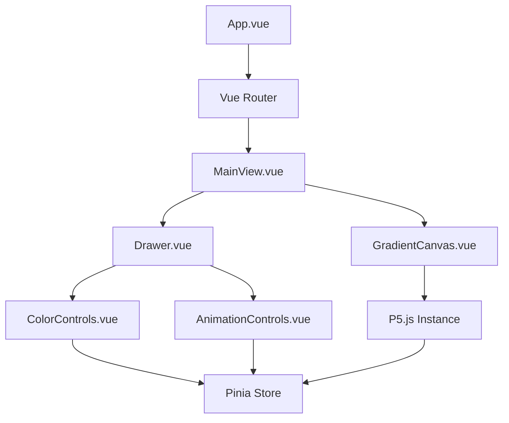

# 🌈 Vue-P5js-Gradient-App

A beautiful, interactive gradient visualization application built with Vue.js and P5.js. Create mesmerizing, animated gradients that undulate across your screen with full customization capabilities.


## ✨ Features

- 🖼️ **Full-Screen Gradient Visualization** - Smooth, animated gradients that fill your browser window
- 🎨 **Dynamic Color Configuration** - Add, remove, and modify gradient color steps in real-time
- ⏱️ **Animation Controls** - Adjust animation speed and patterns for different visual effects
- 📱 **Responsive Design** - Works beautifully on any device or screen size
- 🧩 **Intuitive UI** - Minimalist interface with a sliding drawer for controls
- 💾 **State Persistence** - Your gradient settings are saved between sessions

## 🛠️ Tech Stack

- **[Vue.js 3](https://vuejs.org/)** - Progressive JavaScript framework
- **[P5.js](https://p5js.org/)** - Creative coding library for graphics and animations
- **[Pinia](https://pinia.vuejs.org/)** - Intuitive, type safe state management
- **[Vue Router](https://router.vuejs.org/)** - Official router for Vue.js
- **[Material UI](https://mui.com/)** - Component library for consistent UI design
- **[Vite](https://vitejs.dev/)** - Next generation frontend tooling

## 🚀 Getting Started

### Prerequisites

- Node.js (v16+)
- npm (v7+) or yarn (v1.22+)

### Installation

1. Clone the repository
```sh
git clone https://github.com/yourusername/Vue-P5js-Gradient-App.git
cd Vue-P5js-Gradient-App
```

2. Install dependencies
```sh
npm install
# or
yarn install
```

3. Start the development server
```sh
npm run dev
# or
yarn dev
```

4. Open your browser and navigate to `http://localhost:5173`

## 🎮 How to Use

1. **View the Gradient**: When you first open the app, you'll see a full-screen gradient animation
2. **Open the Controls**: Click the drawer handle on the right side of the screen to open the control panel
3. **Customize Colors**: Use the color pickers to change gradient colors or add new color steps
4. **Adjust Animation**: Use the sliders to change animation speed and behavior
5. **Save Your Creation**: Your settings are automatically saved for your next visit

## 🧪 Development

### Project Structure

```
src/
├── assets/          # Static assets
├── components/      # Vue components
│   ├── ui/          # Generic UI components
│   └── gradient/    # Gradient-specific components
├── composables/     # Reusable composition functions
├── router/          # Vue Router configuration
├── stores/          # Pinia stores
│   ├── gradient.js  # Gradient color steps store
│   └── animation.js # Animation settings store
├── views/           # Page components
└── App.vue          # Root component
```

### Available Scripts

- `npm run dev` - Start the development server
- `npm run build` - Build for production
- `npm run preview` - Preview the production build
- `npm run test:unit` - Run unit tests
- `npm run test:e2e` - Run end-to-end tests
- `npm run lint` - Lint the codebase

## 🧩 Architecture

The application follows a component-based architecture with a clear separation of concerns:



## 🔍 Key Technical Features

- **P5.js Integration**: Uses P5.js in instance mode for better encapsulation within Vue components
- **Reactive State Management**: Pinia stores for managing gradient and animation settings
- **Responsive Canvas**: Automatically resizes to fit any screen size
- **Performance Optimization**: Efficient rendering techniques for smooth animations
- **Component Architecture**: Clean separation of concerns between visualization and UI

## 📝 License

This project is licensed under the MIT License - see the LICENSE file for details.

## 🙏 Acknowledgements

- [Vue.js](https://vuejs.org/) - The Progressive JavaScript Framework
- [P5.js](https://p5js.org/) - JavaScript library for creative coding
- [Pinia](https://pinia.vuejs.org/) - The Vue Store that you will enjoy using
- [Material UI](https://mui.com/) - React components for faster and easier web development

## 🤝 Contributing

Contributions, issues, and feature requests are welcome! Feel free to check the [issues page](https://github.com/yourusername/Vue-P5js-Gradient-App/issues).

1. Fork the project
2. Create your feature branch (`git checkout -b feature/amazing-feature`)
3. Commit your changes (`git commit -m 'Add some amazing feature'`)
4. Push to the branch (`git push origin feature/amazing-feature`)
5. Open a Pull Request

## 📸 Screenshots


