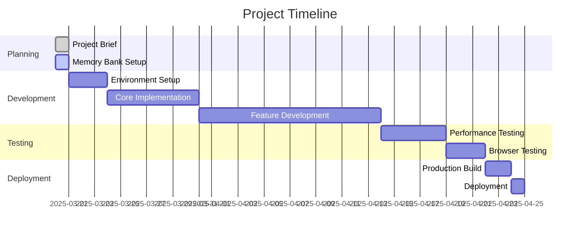

# Progress: Vue.js + P5.js Gradient Visualization App

## Current Status

**Project Phase**: Initialization

The project is currently in the initial setup phase. We have established the memory bank documentation and are preparing to begin development. No code has been written yet.

## What Works

As the project is in the initialization phase, no functional components have been implemented yet. The following has been completed:

- ✅ Project brief documentation
- ✅ Memory bank initialization
- ✅ Architecture planning
- ✅ Technology stack selection

## What's Left to Build

### Phase 1: Core Setup

- [ ] Initialize Vue.js project with Vite
- [ ] Install required dependencies
- [ ] Set up project structure
- [ ] Create basic component skeletons
- [ ] Implement basic routing

### Phase 2: P5.js Integration

- [ ] Create P5.js instance in Vue component
- [ ] Implement canvas resizing
- [ ] Set up basic animation loop
- [ ] Create simple gradient rendering

### Phase 3: State Management

- [ ] Set up Pinia stores
- [ ] Implement gradient color step management
- [ ] Implement animation settings management
- [ ] Add state persistence

### Phase 4: UI Development

- [ ] Create sliding drawer component
- [ ] Implement color picker controls
- [ ] Add animation speed controls
- [ ] Design and implement UI for adding/removing color steps

### Phase 5: Advanced Features

- [ ] Implement undulating animation effects
- [ ] Add gradient interpolation with multiple color steps
- [ ] Optimize performance for smooth animations
- [ ] Implement responsive design for mobile devices

### Phase 6: Testing and Deployment

- [ ] Perform cross-browser testing
- [ ] Optimize for performance
- [ ] Create production build
- [ ] Deploy to hosting platform

## Implementation Progress

| Component | Status | Notes |
|-----------|--------|-------|
| Project Setup | Not Started | Need to initialize Vue project |
| P5.js Canvas | Not Started | Will implement after project setup |
| Pinia Stores | Not Started | Will implement after basic components |
| Drawer UI | Not Started | Will implement after state management |
| Color Controls | Not Started | Will implement as part of drawer UI |
| Animation Controls | Not Started | Will implement as part of drawer UI |
| Gradient Rendering | Not Started | Core P5.js implementation |
| Animation Effects | Not Started | Advanced feature for later phases |
| Responsive Design | Not Started | Will address throughout development |
| State Persistence | Not Started | Will implement after basic functionality |

## Known Issues

As development has not yet begun, there are no known issues at this time. This section will be updated as development progresses and issues are identified.

## Recent Achievements

- Completed project planning and documentation
- Established memory bank for project tracking
- Defined clear architecture and component structure
- Selected appropriate technology stack

## Next Immediate Tasks

1. Initialize Vue.js project with Vite
2. Set up basic project structure
3. Install required dependencies
4. Create skeleton components
5. Implement basic P5.js integration

## Blockers and Challenges

No blockers have been identified at this early stage. Potential challenges that may arise include:

1. Integrating P5.js effectively within Vue's component lifecycle
2. Ensuring smooth performance during gradient animations
3. Managing complex state for multiple color steps
4. Implementing responsive design for the canvas

These challenges will be addressed as development progresses.
