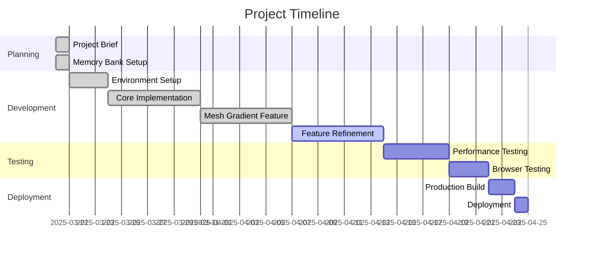

# Progress: Vue.js + P5.js Gradient Visualization App

## Current Status

**Project Phase**: Phase 2 - P5.js Integration (Completed)

The project has completed Phase 2 (P5.js Integration) with the implementation of the gradient mesh feature. We have successfully integrated P5.js with Vue.js, implemented the mesh gradient rendering, added node selection and customization, and connected the UI controls to the visualization. We have also removed the animation features and UI as requested.

## What Works

The following has been completed:

- ✅ Project brief documentation
- ✅ Memory bank initialization
- ✅ Architecture planning
- ✅ Technology stack selection
- ✅ Vue.js project initialization with Vite
- ✅ Installation of required dependencies
- ✅ Project structure setup
- ✅ Basic component skeletons creation
- ✅ Basic routing implementation
- ✅ P5.js integration with Vue.js
- ✅ Mesh gradient implementation
- ✅ Node selection and customization
- ✅ Draggable node positions
- ✅ Mesh visibility toggle
- ✅ Color management for mesh nodes
- ✅ WebGL rendering support
- ✅ Bilinear interpolation for smooth gradients
- ✅ Efficient node lookup with computed grid
- ✅ Touch support for mobile devices

## What's Left to Build

### Phase 1: Core Setup

- ✅ Initialize Vue.js project with Vite
- ✅ Install required dependencies
- ✅ Set up project structure
- ✅ Create basic component skeletons
- ✅ Implement basic routing

### Phase 2: P5.js Integration

- ✅ Create P5.js instance in Vue component
- ✅ Implement canvas resizing
- ✅ Set up animation loop with consistent timing
- ✅ Create mesh gradient rendering

### Phase 3: Mesh Gradient Implementation

- ✅ Implement configurable mesh grid
- ✅ Add node selection and color editing
- ✅ Implement draggable node positions
- ✅ Add mesh visibility toggle
- ✅ Create MeshControls component

### Phase 4: Feature Refinement

- ⏳ Further optimize mesh rendering performance
- ⏳ Improve color interpolation between nodes
- ⏳ Add more advanced mesh manipulation options
- ⏳ Implement better visual feedback for selected nodes

### Phase 5: UI Improvements

- ⏳ Enhance node selection interface
- ⏳ Add more intuitive controls for mesh manipulation
- ⏳ Implement better visual feedback for selected nodes
- ⏳ Optimize UI for mobile devices
- ⏳ Add touch interaction improvements

### Phase 6: Performance Optimization

- ⏳ Optimize for 60 FPS rendering
- ⏳ Implement more efficient node lookup and rendering
- ⏳ Add GPU acceleration where possible
- ⏳ Optimize memory usage for complex gradients
- ⏳ Implement responsive design for mobile devices

### Phase 7: Testing and Deployment

- ⏳ Perform cross-browser testing
- ⏳ Test on various screen sizes and devices
- ⏳ Create production build
- ⏳ Deploy to hosting platform

## Implementation Progress

| Component | Status | Notes |
|-----------|--------|-------|
| Project Setup | Completed | Vue project initialized with Vite |
| P5.js Canvas | Completed | P5.js instance integrated with Vue |
| Pinia Stores | Completed | Gradient store created |
| Drawer UI | Completed | Drawer component implemented |
| Color Controls | Completed | Color controls for gradient and mesh nodes |
| Mesh Controls | Completed | Controls for mesh rows, columns, and visibility |
| Mesh Gradient | Completed | Mesh gradient rendering with triangles |
| Node Selection | Completed | Selection and dragging of mesh nodes |
| Node Color Editing | Completed | Color editing for selected nodes |
| WebGL Support | Completed | Hardware acceleration with WebGL |
| Bilinear Interpolation | Completed | Smooth color transitions between nodes |
| Touch Support | Completed | Basic touch interactions for mobile devices |
| Animation Features | Removed | Animation features removed as requested |
| Responsive Design | In Progress | Basic responsive layout implemented |
| Performance Optimization | In Progress | WebGL support added, further optimizations needed |

## Known Issues

1. Performance may degrade with large mesh grid sizes (e.g., more than 20x20)
2. Color picker doesn't show the current color of the selected node
3. Node selection can be difficult on mobile devices due to small touch targets
4. WebGL rendering may not be supported on all devices
5. Dragging nodes near the edge of the canvas can be challenging

## Recent Achievements

- Implemented the gradient mesh feature with configurable rows and columns
- Added mesh node selection and color editing functionality
- Implemented draggable node positions for custom gradient shapes
- Added mesh visibility toggle
- Created a new MeshControls component for mesh-specific settings
- Removed the spline feature as requested
- Removed the old linear and radial gradient types, focusing exclusively on the mesh gradient
- Removed animation features and UI as requested
- Updated the UI to reflect these changes
- Optimized mesh rendering with WebGL support
- Improved color interpolation with bilinear interpolation
- Added efficient node lookup with computed grid
- Enhanced node selection and dragging interactions

## Next Immediate Tasks

1. Further optimize mesh rendering performance for large grid sizes
2. Improve color interpolation between mesh nodes
3. Add more advanced mesh manipulation options
4. Enhance the node selection interface
5. Add more intuitive controls for mesh manipulation
6. Implement better visual feedback for selected nodes

## Blockers and Challenges

No blockers have been identified at this stage. Potential challenges that may arise include:

1. Optimizing performance for large mesh grid sizes
2. Implementing efficient GPU acceleration for mesh gradient rendering
3. Creating intuitive touch interactions for mobile devices
4. Ensuring smooth 60 FPS performance during complex operations

These challenges will be addressed as development progresses.
