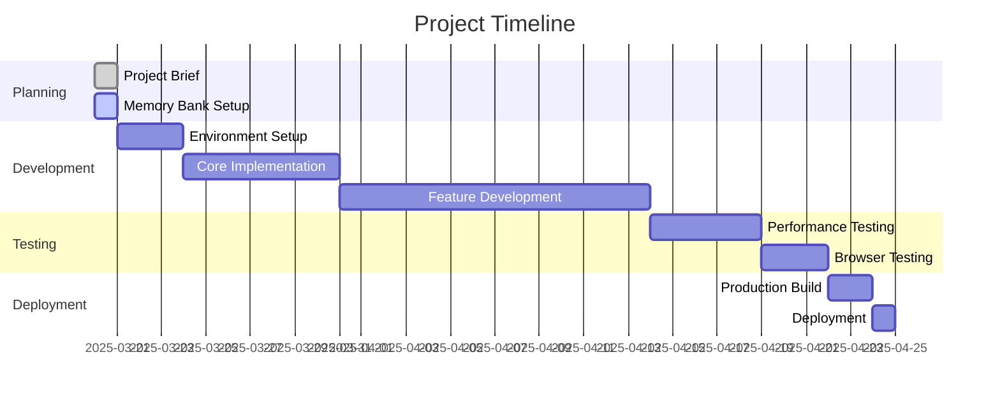

# Progress: Vue.js + P5.js Gradient Visualization App

## Current Status

**Project Phase**: Phase 1 - Core Setup (Completed)

The project has completed Phase 1 (Core Setup). We have initialized the Vue.js project with Vite, installed all required dependencies, set up the project structure, created basic component skeletons, and implemented basic routing. The development server is running, and we're ready to move on to Phase 2 (P5.js Integration) with expanded gradient feature requirements.

## What Works

The following has been completed:

- ✅ Project brief documentation
- ✅ Memory bank initialization
- ✅ Architecture planning
- ✅ Technology stack selection
- ✅ Vue.js project initialization with Vite
- ✅ Installation of required dependencies
- ✅ Project structure setup
- ✅ Basic component skeletons creation
- ✅ Basic routing implementation

## What's Left to Build

### Phase 1: Core Setup

- ✅ Initialize Vue.js project with Vite
- ✅ Install required dependencies
- ✅ Set up project structure
- ✅ Create basic component skeletons
- ✅ Implement basic routing

### Phase 2: P5.js Integration

- [ ] Create P5.js instance in Vue component
- [ ] Implement canvas resizing
- [ ] Set up animation loop with consistent timing
- [ ] Create gradient rendering with spline path support

### Phase 3: Gradient Types Implementation

- [ ] Implement linear gradient type
- [ ] Implement radial gradient type
- [ ] Implement shaped gradient type (following spline path)
- [ ] Add UI for switching between gradient types

### Phase 4: Spline Path Editing

- [ ] Implement node creation, deletion, and dragging
- [ ] Create dynamic spline recalculation
- [ ] Add UI for spline path editing

### Phase 5: Color Management

- [ ] Implement multiple color stops with position control
- [ ] Add color blending with smoothness control
- [ ] Create real-time gradient updates when colors change

### Phase 6: State Management

- ✅ Set up Pinia stores
- ✅ Implement gradient color step management
- ✅ Implement animation settings management
- [ ] Add state persistence
- [ ] Connect the gradient rendering to the Pinia stores
- [ ] Implement reactivity between UI controls and visualization

### Phase 7: UI Development

- ✅ Create sliding drawer component
- ✅ Implement color picker controls
- ✅ Add animation speed controls
- ✅ Design and implement UI for adding/removing color steps
- [ ] Add UI for spline node editing
- [ ] Implement gradient type selector
- [ ] Add blend/smoothness slider

### Phase 8: Performance Optimization

- [ ] Optimize for 60 FPS animations
- [ ] Implement GPU acceleration where possible
- [ ] Optimize memory usage for complex gradients
- [ ] Implement responsive design for mobile devices

### Phase 9: Testing and Deployment

- [ ] Perform cross-browser testing
- [ ] Test on various screen sizes and devices
- [ ] Create production build
- [ ] Deploy to hosting platform

## Implementation Progress

| Component | Status | Notes |
|-----------|--------|-------|
| Project Setup | Completed | Vue project initialized with Vite |
| P5.js Canvas | In Progress | Basic component created, needs implementation |
| Pinia Stores | Completed | Gradient and animation stores created |
| Drawer UI | Completed | Basic drawer component created |
| Color Controls | Completed | Basic color controls component created |
| Animation Controls | Completed | Basic animation controls component created |
| Gradient Rendering | Not Started | Will implement in Phase 2 with spline support |
| Spline Path Editing | Not Started | Will implement in Phase 4 |
| Gradient Types | Not Started | Will implement linear, radial, and shaped types in Phase 3 |
| Color Management | Not Started | Will implement multiple color stops and blending in Phase 5 |
| Animation Effects | Not Started | Will implement color cycling along paths |
| Responsive Design | In Progress | Basic responsive layout implemented |
| State Persistence | Not Started | Will implement after basic functionality |
| Performance Optimization | Not Started | Will target 60 FPS with GPU acceleration |

## Known Issues

As development has not yet begun, there are no known issues at this time. This section will be updated as development progresses and issues are identified.

## Recent Achievements

- Completed project planning and documentation
- Established memory bank for project tracking
- Defined clear architecture and component structure
- Selected appropriate technology stack
- Initialized Vue.js project with Vite
- Installed all required dependencies
- Set up project structure following best practices
- Created basic component skeletons for all major components
- Implemented basic routing
- Created Pinia stores for gradient and animation state management

## Next Immediate Tasks

1. Implement P5.js instance in the GradientCanvas component
2. Set up canvas resizing to be responsive to window size changes
3. Implement animation loop with consistent timing
4. Create gradient rendering with spline path support
5. Begin implementation of different gradient types (linear, radial, shaped)
6. Start designing the spline path editing interface

## Blockers and Challenges

No blockers have been identified at this early stage. Potential challenges that may arise include:

1. Integrating P5.js effectively within Vue's component lifecycle
2. Implementing efficient spline path calculations and rendering
3. Ensuring smooth 60 FPS performance during gradient animations
4. Managing complex state for multiple color stops and gradient types
5. Creating an intuitive UI for spline node editing
6. Implementing GPU acceleration for optimal performance
7. Handling touch interactions for mobile spline editing

These challenges will be addressed as development progresses.
