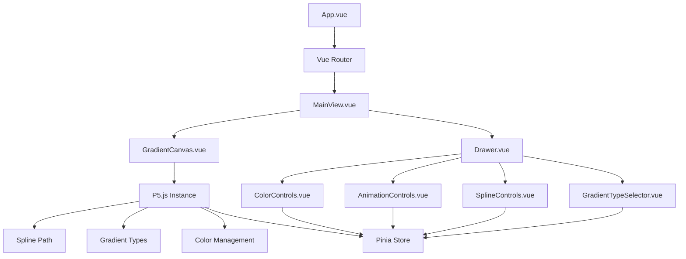
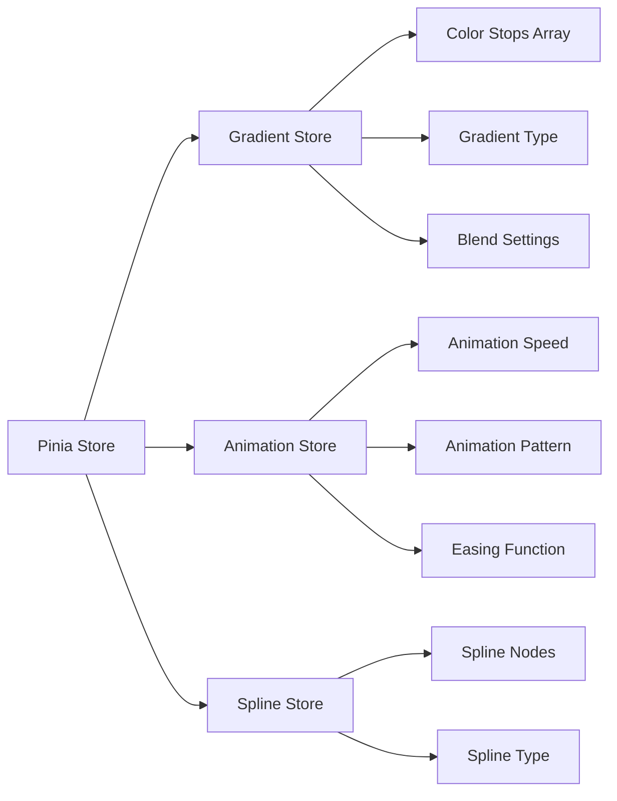
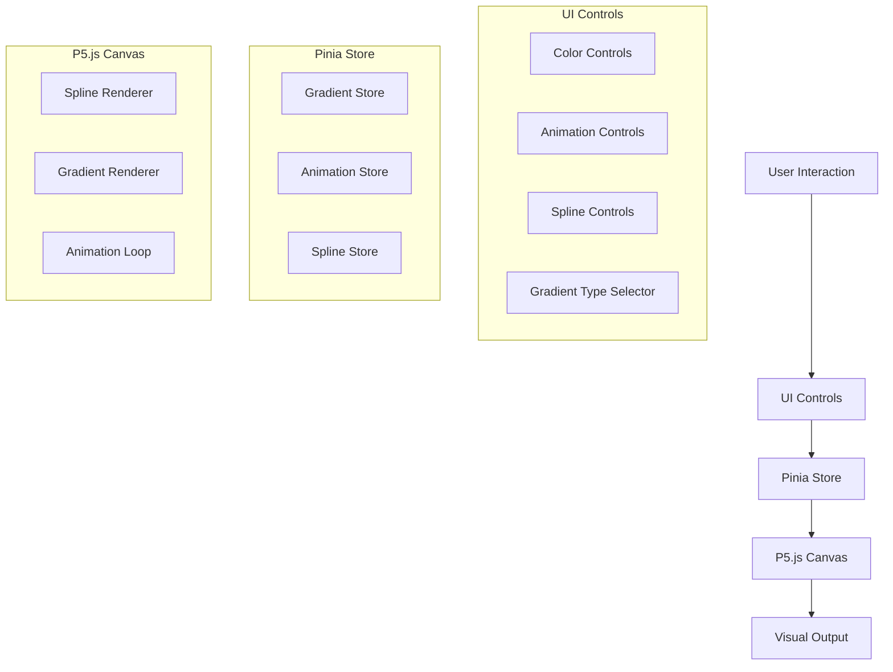
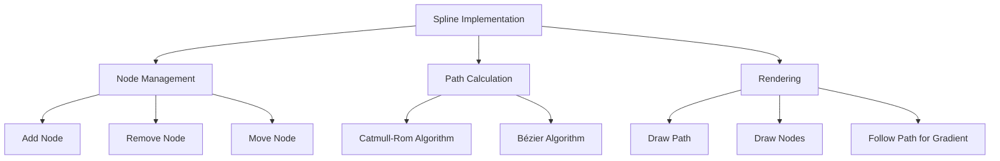

# System Patterns: Vue.js + P5.js Gradient Visualization App

## System Architecture

The application follows a component-based architecture using Vue.js, with a clear separation of concerns between visualization, UI controls, and state management.



### Key Components

1. **App.vue**: Root component that sets up the application and handles routing
2. **MainView.vue**: Primary view that contains both the canvas and drawer components
3. **GradientCanvas.vue**: Manages the P5.js instance and handles the gradient visualization
4. **Drawer.vue**: Container for the UI controls that slides in/out from the right
5. **ColorControls.vue**: Interface for adding, removing, and adjusting gradient color stops
6. **AnimationControls.vue**: Interface for configuring animation timing and behavior
7. **SplineControls.vue**: Interface for adding, removing, and adjusting spline nodes
8. **GradientTypeSelector.vue**: Interface for switching between gradient types (linear, radial, shaped)

## Key Technical Decisions

### 1. P5.js Integration

P5.js will be integrated using the **instance mode** rather than global mode. This approach:
- Encapsulates P5.js functionality within Vue components
- Prevents global namespace pollution
- Allows multiple P5 instances if needed
- Provides better control over the P5 lifecycle

Implementation pattern:
```javascript
// In GradientCanvas.vue
import { defineComponent, onMounted, onUnmounted, ref } from 'vue'
import p5 from 'p5'

export default defineComponent({
  setup() {
    const canvasContainer = ref(null)
    let p5Instance = null
    
    onMounted(() => {
      p5Instance = new p5(sketch, canvasContainer.value)
    })
    
    onUnmounted(() => {
      if (p5Instance) {
        p5Instance.remove()
      }
    })
    
    const sketch = (p) => {
      p.setup = () => {
        // Setup code
      }
      
      p.draw = () => {
        // Draw code
      }
      
      p.windowResized = () => {
        // Resize handling
      }
    }
    
    return { canvasContainer }
  }
})
```

### 2. State Management

Pinia will be used for state management with a structure that separates gradient, animation, and spline path concerns:



Store structure:
```javascript
// gradientStore.js
export const useGradientStore = defineStore('gradient', {
  state: () => ({
    colorStops: [
      { id: 1, color: '#ff0000', position: 0 },
      { id: 2, color: '#0000ff', position: 1 }
    ],
    gradientType: 'linear', // 'linear', 'radial', 'shaped'
    blendSettings: {
      smoothness: 0.5 // 0-1 range for transition sharpness
    }
  }),
  actions: {
    addColorStop(color, position) { /* ... */ },
    removeColorStop(id) { /* ... */ },
    updateColorStop(id, color, position) { /* ... */ },
    setGradientType(type) { /* ... */ },
    updateBlendSettings(settings) { /* ... */ }
  },
  persist: true
})

// animationStore.js
export const useAnimationStore = defineStore('animation', {
  state: () => ({
    speed: 0.01,
    pattern: 'sine', // 'sine', 'cosine', 'linear'
    easing: 'linear', // 'linear', 'ease-in', 'ease-out', 'ease-in-out'
    isPlaying: false
  }),
  actions: {
    updateSpeed(speed) { /* ... */ },
    updatePattern(pattern) { /* ... */ },
    updateEasing(easing) { /* ... */ },
    togglePlayback() { /* ... */ }
  },
  persist: true
})

// splineStore.js
export const useSplineStore = defineStore('spline', {
  state: () => ({
    nodes: [
      { id: 1, x: 100, y: 100 },
      { id: 2, x: 300, y: 200 },
      { id: 3, x: 500, y: 100 }
    ],
    splineType: 'catmull-rom' // 'catmull-rom', 'bezier'
  }),
  actions: {
    addNode(x, y) { /* ... */ },
    removeNode(id) { /* ... */ },
    updateNodePosition(id, x, y) { /* ... */ },
    setSplineType(type) { /* ... */ }
  },
  persist: true
})
```

### 3. Responsive Design

The application will use a combination of Vue's reactive system and P5.js's built-in resize handling:

- `@vueuse/core` will be used to reactively track window dimensions
- P5.js's `windowResized()` function will handle canvas resizing
- CSS Grid/Flexbox will ensure the UI adapts to different screen sizes
- Media queries will adjust the drawer behavior on mobile devices

## Design Patterns

### 1. Observer Pattern

- Implemented via Vue's reactive system and Pinia
- Components observe and react to state changes
- P5.js visualization updates when gradient, animation, or spline settings change

### 2. Container/Presentational Pattern

- Container components (MainView) manage state and logic
- Presentational components (ColorControls, AnimationControls, SplineControls) focus on UI
- Promotes reusability and separation of concerns

### 3. Composition Pattern

- Vue Composition API used throughout the application
- Logic extracted into composable functions for reuse
- Examples:
  - `useP5` composable to handle P5.js instance creation and lifecycle
  - `useSpline` composable for spline calculations
  - `useGradient` composable for gradient rendering logic

### 4. Factory Pattern

- Used for creating gradient configurations
- Standardizes the creation of color stop objects
- Ensures consistent data structure for spline nodes

### 5. Strategy Pattern

- Used for implementing different gradient types
- Each gradient type (linear, radial, shaped) is a separate strategy
- Allows for dynamic switching between gradient types at runtime

### 6. Command Pattern

- Used for implementing undo/redo functionality for spline editing
- Each user action (add node, move node, delete node) is a command
- Commands can be undone and redone

## Component Relationships

### Data Flow



### Event Handling

1. **User Interactions**:
   - Color selection triggers `updateColorStop` action in gradient store
   - Slider changes update animation speed in animation store
   - Add/remove buttons modify the color stops array
   - Gradient type selection updates the gradient type in store
   - Spline node dragging updates node positions in spline store
   - Add/remove node buttons modify the spline nodes array

2. **Store Updates**:
   - Trigger reactivity in the P5.js component
   - P5.js redraws the canvas with new settings
   - UI components reflect the current state
   - Spline path recalculates when nodes change

3. **Canvas Events**:
   - Window resize events trigger canvas resizing
   - Animation frame updates based on current time and settings
   - Mouse/touch events for interacting with spline nodes directly on canvas
   - Gradient rendering updates based on selected gradient type

## Performance Considerations

1. **Throttling/Debouncing**:
   - Resize events will be debounced to prevent excessive redraws
   - Color updates will be throttled during drag operations
   - Spline node position updates will be throttled during dragging

2. **Memoization**:
   - Computed properties will cache complex calculations
   - Color interpolation results will be memoized when possible
   - Spline path calculations will be cached until nodes change

3. **Lazy Loading**:
   - Non-critical components will be lazy-loaded
   - P5.js will be imported dynamically when needed

4. **GPU Acceleration**:
   - WebGL mode will be used for P5.js when available
   - Hardware acceleration will be enabled for gradient rendering
   - Complex calculations will be offloaded to shaders when possible

5. **Optimized Rendering**:
   - Only redraw when necessary
   - Use requestAnimationFrame for smooth animations
   - Maintain consistent 60 FPS target
   - Scale complexity based on device capabilities
## Spline Path Implementation

The spline path will be implemented using either Catmull-Rom or Bézier splines:



### Spline Calculation

For Catmull-Rom splines, the following algorithm will be used:

```javascript
function catmullRomSpline(p0, p1, p2, p3, t, alpha = 0.5) {
  const t0 = 0;
  const t1 = Math.pow(Math.sqrt(Math.pow(p1.x - p0.x, 2) + Math.pow(p1.y - p0.y, 2)), alpha) + t0;
  const t2 = Math.pow(Math.sqrt(Math.pow(p2.x - p1.x, 2) + Math.pow(p2.y - p1.y, 2)), alpha) + t1;
  const t3 = Math.pow(Math.sqrt(Math.pow(p3.x - p2.x, 2) + Math.pow(p3.y - p2.y, 2)), alpha) + t2;
  
  const t = t1 + (t2 - t1) * t;
  
  const a1 = (t1 - t) / (t1 - t0) * p0.x + (t - t0) / (t1 - t0) * p1.x;
  const a2 = (t2 - t) / (t2 - t1) * p1.x + (t - t1) / (t2 - t1) * p2.x;
  const a3 = (t3 - t) / (t3 - t2) * p2.x + (t - t2) / (t3 - t2) * p3.x;
  
  const b1 = (t2 - t) / (t2 - t0) * a1 + (t - t0) / (t2 - t0) * a2;
  const b2 = (t3 - t) / (t3 - t1) * a2 + (t - t1) / (t3 - t1) * a3;
  
  const x = (t2 - t) / (t2 - t1) * b1 + (t - t1) / (t2 - t1) * b2;
  
  // Similar calculation for y coordinate
  // ...
  
  return { x, y };
}
```

## Gradient Types Implementation

Three gradient types will be supported:

### 1. Linear Gradient

```javascript
function drawLinearGradient(p, colorStops, startX, startY, endX, endY) {
  for (let i = 0; i < p.width; i++) {
    const t = i / p.width;
    const color = interpolateColors(colorStops, t);
    p.stroke(color);
    p.line(i, 0, i, p.height);
  }
}
```

### 2. Radial Gradient

```javascript
function drawRadialGradient(p, colorStops, centerX, centerY, radius) {
  for (let r = 0; r <= radius; r++) {
    const t = r / radius;
    const color = interpolateColors(colorStops, t);
    p.stroke(color);
    p.noFill();
    p.circle(centerX, centerY, r * 2);
  }
}
```

### 3. Shaped Gradient (Following Spline Path)

```javascript
function drawShapedGradient(p, colorStops, splineNodes, splineType) {
  const points = calculateSplinePath(splineNodes, splineType);
  
  for (let i = 0; i < points.length; i++) {
    const t = i / (points.length - 1);
    const color = interpolateColors(colorStops, t);
    p.stroke(color);
    p.point(points[i].x, points[i].y);
    
    // Draw perpendicular lines with gradient
    // ...
  }
}
```

## Color Management

Color interpolation will be implemented with support for multiple color stops and smoothness control:

```javascript
function interpolateColors(colorStops, t, smoothness = 0.5) {
  // Find the two color stops that t falls between
  let start = colorStops[0];
  let end = colorStops[colorStops.length - 1];
  
  for (let i = 0; i < colorStops.length - 1; i++) {
    if (t >= colorStops[i].position && t <= colorStops[i + 1].position) {
      start = colorStops[i];
      end = colorStops[i + 1];
      break;
    }
  }
  
  // Normalize t to the range between these two stops
  const normalizedT = (t - start.position) / (end.position - start.position);
  
  // Apply smoothness (easing function)
  const easedT = applyEasing(normalizedT, smoothness);
  
  // Interpolate between the two colors
  return p5.lerpColor(p.color(start.color), p.color(end.color), easedT);
}

function applyEasing(t, smoothness) {
  // Apply different easing functions based on smoothness
  if (smoothness < 0.33) {
    // More abrupt transition (ease-in)
    return t * t;
  } else if (smoothness < 0.66) {
    // Linear transition
    return t;
  } else {
    // Smoother transition (ease-out)
    return 1 - Math.pow(1 - t, 2);
  }
}
```
