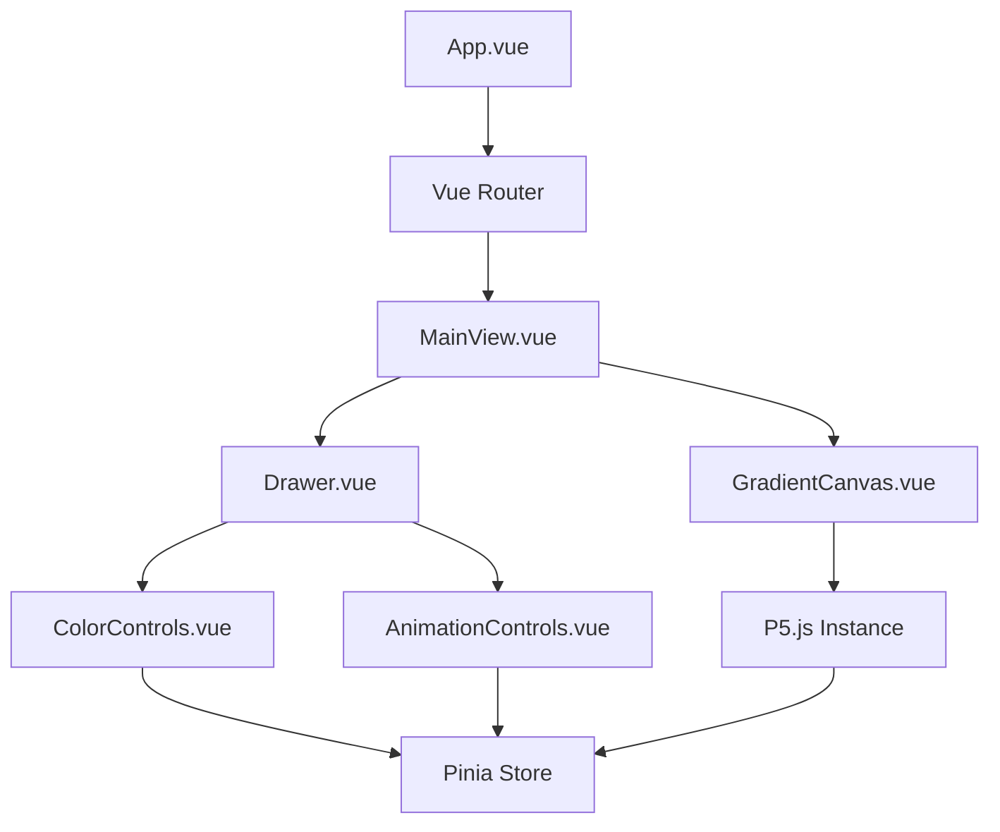
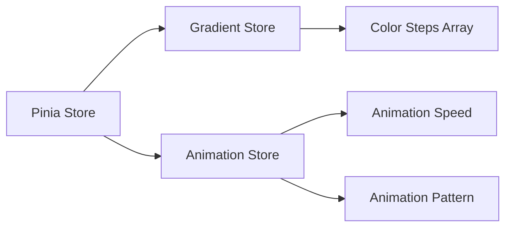
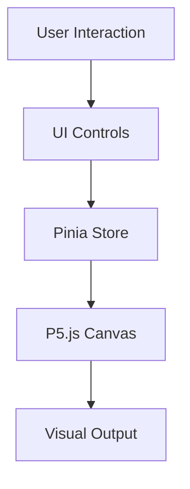

# System Patterns: Vue.js + P5.js Gradient Visualization App

## System Architecture

The application follows a component-based architecture using Vue.js, with a clear separation of concerns between visualization, UI controls, and state management.



### Key Components

1. **App.vue**: Root component that sets up the application and handles routing
2. **MainView.vue**: Primary view that contains both the canvas and drawer components
3. **GradientCanvas.vue**: Manages the P5.js instance and handles the gradient visualization
4. **Drawer.vue**: Container for the UI controls that slides in/out from the right
5. **ColorControls.vue**: Interface for adding, removing, and adjusting gradient color steps
6. **AnimationControls.vue**: Interface for configuring animation timing and behavior

## Key Technical Decisions

### 1. P5.js Integration

P5.js will be integrated using the **instance mode** rather than global mode. This approach:
- Encapsulates P5.js functionality within Vue components
- Prevents global namespace pollution
- Allows multiple P5 instances if needed
- Provides better control over the P5 lifecycle

Implementation pattern:
```javascript
// In GradientCanvas.vue
import { defineComponent, onMounted, onUnmounted, ref } from 'vue'
import p5 from 'p5'

export default defineComponent({
  setup() {
    const canvasContainer = ref(null)
    let p5Instance = null
    
    onMounted(() => {
      p5Instance = new p5(sketch, canvasContainer.value)
    })
    
    onUnmounted(() => {
      if (p5Instance) {
        p5Instance.remove()
      }
    })
    
    const sketch = (p) => {
      p.setup = () => {
        // Setup code
      }
      
      p.draw = () => {
        // Draw code
      }
      
      p.windowResized = () => {
        // Resize handling
      }
    }
    
    return { canvasContainer }
  }
})
```

### 2. State Management

Pinia will be used for state management with a structure that separates gradient and animation concerns:



Store structure:
```javascript
// gradientStore.js
export const useGradientStore = defineStore('gradient', {
  state: () => ({
    colorSteps: [
      { id: 1, color: '#ff0000', position: 0 },
      { id: 2, color: '#0000ff', position: 1 }
    ]
  }),
  actions: {
    addColorStep(color) { /* ... */ },
    removeColorStep(id) { /* ... */ },
    updateColorStep(id, color) { /* ... */ }
  },
  persist: true
})

// animationStore.js
export const useAnimationStore = defineStore('animation', {
  state: () => ({
    speed: 0.01,
    pattern: 'sine', // 'sine', 'cosine', 'linear'
  }),
  actions: {
    updateSpeed(speed) { /* ... */ },
    updatePattern(pattern) { /* ... */ }
  },
  persist: true
})
```

### 3. Responsive Design

The application will use a combination of Vue's reactive system and P5.js's built-in resize handling:

- `@vueuse/core` will be used to reactively track window dimensions
- P5.js's `windowResized()` function will handle canvas resizing
- CSS Grid/Flexbox will ensure the UI adapts to different screen sizes
- Media queries will adjust the drawer behavior on mobile devices

## Design Patterns

### 1. Observer Pattern

- Implemented via Vue's reactive system and Pinia
- Components observe and react to state changes
- P5.js visualization updates when gradient or animation settings change

### 2. Container/Presentational Pattern

- Container components (MainView) manage state and logic
- Presentational components (ColorControls, AnimationControls) focus on UI
- Promotes reusability and separation of concerns

### 3. Composition Pattern

- Vue Composition API used throughout the application
- Logic extracted into composable functions for reuse
- Example: A `useP5` composable to handle P5.js instance creation and lifecycle

### 4. Factory Pattern

- Used for creating gradient configurations
- Standardizes the creation of color step objects
- Ensures consistent data structure

## Component Relationships

### Data Flow



### Event Handling

1. **User Interactions**:
   - Color selection triggers `updateColorStep` action in store
   - Slider changes update animation speed in store
   - Add/remove buttons modify the color steps array

2. **Store Updates**:
   - Trigger reactivity in the P5.js component
   - P5.js redraws the canvas with new settings
   - UI components reflect the current state

3. **Canvas Events**:
   - Window resize events trigger canvas resizing
   - Animation frame updates based on current time and settings

## Performance Considerations

1. **Throttling/Debouncing**:
   - Resize events will be debounced to prevent excessive redraws
   - Color updates will be throttled during drag operations

2. **Memoization**:
   - Computed properties will cache complex calculations
   - Color interpolation results will be memoized when possible

3. **Lazy Loading**:
   - Non-critical components will be lazy-loaded
   - P5.js will be imported dynamically when needed
