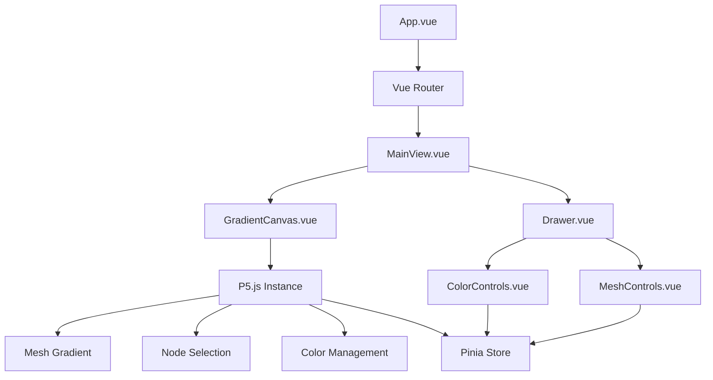
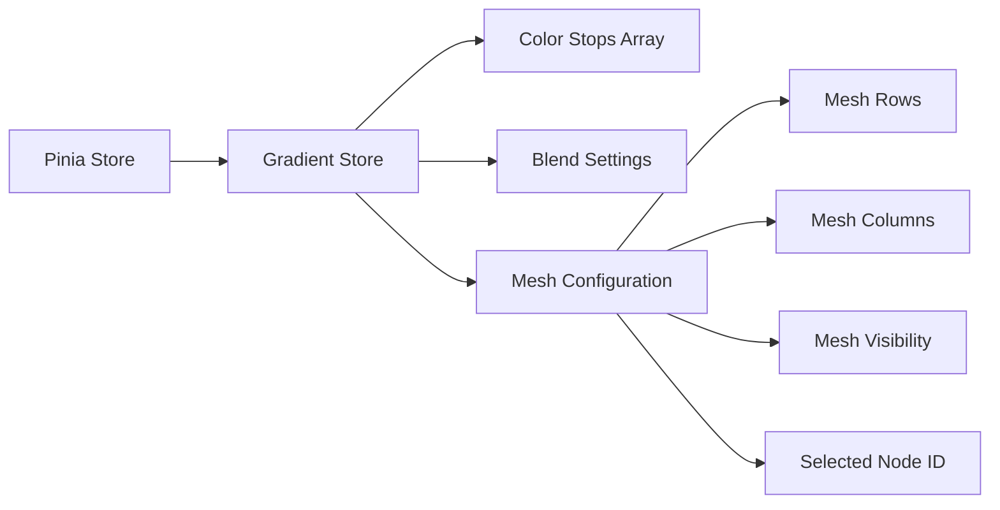
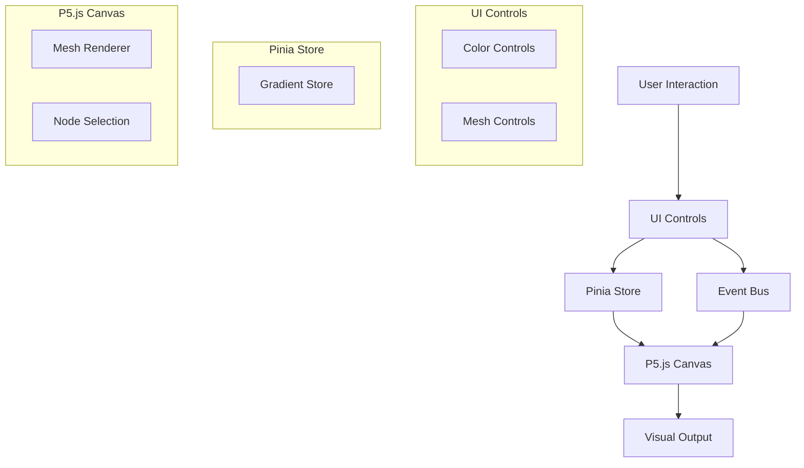
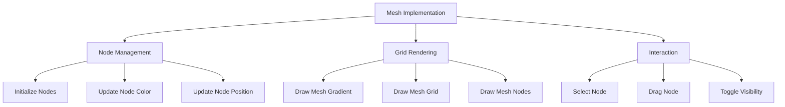

# System Patterns: Vue.js + P5.js Gradient Visualization App

## System Architecture

The application follows a component-based architecture using Vue.js, with a clear separation of concerns between visualization, UI controls, and state management.



### Key Components

1. **App.vue**: Root component that sets up the application and handles routing
2. **MainView.vue**: Primary view that contains both the canvas and drawer components
3. **GradientCanvas.vue**: Manages the P5.js instance and handles the gradient visualization
4. **Drawer.vue**: Container for the UI controls that slides in/out from the right
5. **ColorControls.vue**: Interface for adding, removing, and adjusting gradient color stops and mesh node colors
6. **MeshControls.vue**: Interface for configuring mesh rows, columns, and visibility

## Key Technical Decisions

### 1. P5.js Integration

P5.js is integrated using the **instance mode** rather than global mode. This approach:
- Encapsulates P5.js functionality within Vue components
- Prevents global namespace pollution
- Allows multiple P5 instances if needed
- Provides better control over the P5 lifecycle

Implementation pattern:
```javascript
// In GradientCanvas.vue
import { ref, onMounted, onUnmounted } from 'vue'
import p5 from 'p5'

// Component setup
const canvasContainer = ref(null)
let p5Instance = null

// P5.js sketch function
const sketch = (p) => {
  p.setup = () => {
    // Setup code
  }
  
  p.draw = () => {
    // Draw code
  }
  
  p.windowResized = () => {
    // Resize handling
  }
}

onMounted(() => {
  if (canvasContainer.value) {
    p5Instance = new p5(sketch, canvasContainer.value)
  }
})

onUnmounted(() => {
  if (p5Instance) {
    p5Instance.remove()
  }
})
```

### 2. State Management

Pinia is used for state management with a structure that focuses on gradient configuration:



Store structure:
```javascript
// gradientStore.js
export const useGradientStore = defineStore('gradient', () => {
  const colorStops = ref([
    { id: 1, color: '#ff0000', position: 0 },
    { id: 2, color: '#0000ff', position: 1 }
  ])
  
  const blendSettings = ref({
    smoothness: 0.5 // 0-1 range for transition sharpness
  })

  // Mesh configuration
  const meshRows = ref(6)
  const meshColumns = ref(4)
  const meshVisibility = ref(true)
  const selectedNodeId = ref(null)

  function addColorStop(color, position) { /* ... */ }
  function removeColorStop(id) { /* ... */ }
  function updateColorStop(id, updates) { /* ... */ }
  function updateBlendSettings(settings) { /* ... */ }
  function setMeshRows(rows) { /* ... */ }
  function setMeshColumns(columns) { /* ... */ }
  function toggleMeshVisibility() { /* ... */ }
  function selectNode(nodeId) { /* ... */ }

  return {
    colorStops,
    blendSettings,
    meshRows,
    meshColumns,
    meshVisibility,
    selectedNodeId,
    addColorStop,
    removeColorStop,
    updateColorStop,
    updateBlendSettings,
    setMeshRows,
    setMeshColumns,
    toggleMeshVisibility,
    selectNode
  }
})
```

### 3. Mesh Gradient Implementation

The mesh gradient is implemented using a grid-based approach with rows and columns:

```javascript
// Mesh nodes data structure
interface MeshNode {
  id: number
  row: number
  col: number
  x: number
  y: number
  color: string
  manuallyMoved?: boolean
}

// Initialize mesh nodes
const initializeMeshNodes = () => {
  const newNodes = []
  const rows = meshRows.value
  const cols = meshColumns.value
  
  for (let row = 0; row < rows; row++) {
    for (let col = 0; col < cols; col++) {
      // Calculate normalized position (0-1)
      const normalizedX = col / (cols - 1)
      const normalizedY = row / (rows - 1)
      
      // Calculate actual pixel position
      const x = normalizedX * width.value
      const y = normalizedY * height.value
      
      // Generate a color based on position
      const color = getColorForPosition(normalizedX, normalizedY)
      
      newNodes.push({
        id: row * cols + col,
        row,
        col,
        x,
        y,
        color
      })
    }
  }
  
  meshNodes.value = newNodes
}
```

The mesh gradient is rendered using triangles for smooth color blending:

```javascript
// Draw the mesh gradient using triangles
const drawMeshGradient = (p) => {
  if (meshNodes.value.length < 4) return
  
  // For each cell in the mesh grid (defined by 4 nodes), draw 2 triangles
  for (let row = 0; row < meshRows.value - 1; row++) {
    for (let col = 0; col < meshColumns.value - 1; col++) {
      // Get the 4 nodes that define this cell
      const topLeft = meshNodes.value.find(n => n.row === row && n.col === col)
      const topRight = meshNodes.value.find(n => n.row === row && n.col === col + 1)
      const bottomLeft = meshNodes.value.find(n => n.row === row + 1 && n.col === col)
      const bottomRight = meshNodes.value.find(n => n.row === row + 1 && n.col === col + 1)
      
      if (topLeft && topRight && bottomLeft && bottomRight) {
        // Draw first triangle (top-left, bottom-left, top-right)
        p.noStroke()
        p.beginShape(p.TRIANGLES)
        
        p.fill(p.color(topLeft.color))
        p.vertex(topLeft.x, topLeft.y)
        
        p.fill(p.color(bottomLeft.color))
        p.vertex(bottomLeft.x, bottomLeft.y)
        
        p.fill(p.color(topRight.color))
        p.vertex(topRight.x, topRight.y)
        
        p.endShape()
        
        // Draw second triangle (bottom-left, bottom-right, top-right)
        p.beginShape(p.TRIANGLES)
        
        p.fill(p.color(bottomLeft.color))
        p.vertex(bottomLeft.x, bottomLeft.y)
        
        p.fill(p.color(bottomRight.color))
        p.vertex(bottomRight.x, bottomRight.y)
        
        p.fill(p.color(topRight.color))
        p.vertex(topRight.x, topRight.y)
        
        p.endShape()
      }
    }
  }
}
```

### 4. Event System

A custom event emitter is used for mesh node color updates:

```javascript
// Create a custom event bus for mesh node color updates
const emitter = mitt<{
  'update-mesh-node-color': { id: number; color: string }
}>()

// Listen for color update events
emitter.on('update-mesh-node-color', ({ id, color }) => {
  const node = meshNodes.value.find(n => n.id === id)
  if (node) {
    node.color = color
  }
})

// Expose the emitter to the parent component
defineExpose({ emitter })
```

The event system is connected through the component hierarchy:

```javascript
// In ColorControls.vue
const emit = defineEmits<{
  (e: 'update-mesh-node-color', payload: { id: number; color: string }): void
}>()

// Update a color stop
const updateColor = (id: number, color: string) => {
  // Check if this is a mesh node or a color stop
  if (id === selectedNodeId.value) {
    // This is a mesh node - emit an event to update the mesh node color
    emit('update-mesh-node-color', { id, color })
  } else {
    // This is a regular color stop
    gradientStore.updateColorStop(id, { color })
  }
}

// In Drawer.vue
const emit = defineEmits<{
  (e: 'update-mesh-node-color', payload: { id: number; color: string }): void
}>()

// Forward events from ColorControls
const handleMeshNodeColorUpdate = (payload: { id: number; color: string }) => {
  emit('update-mesh-node-color', payload)
}

// In MainView.vue
const handleMeshNodeColorUpdate = (payload: { id: number; color: string }) => {
  // Forward the event to the GradientCanvas component's emitter
  if (canvasRef.value && canvasRef.value.emitter) {
    canvasRef.value.emitter.emit('update-mesh-node-color', payload)
  }
}
```

## Design Patterns

### 1. Observer Pattern

- Implemented via Vue's reactive system and Pinia
- Components observe and react to state changes
- P5.js visualization updates when gradient settings change

### 2. Container/Presentational Pattern

- Container components (MainView) manage state and logic
- Presentational components (ColorControls, MeshControls) focus on UI
- Promotes reusability and separation of concerns

### 3. Composition Pattern

- Vue Composition API used throughout the application
- Logic extracted into composable functions for reuse
- Examples:
  - `useP5` composable to handle P5.js instance creation and lifecycle
  - `useGradient` composable for gradient rendering logic

### 4. Factory Pattern

- Used for creating mesh nodes and color stop objects
- Standardizes the creation of data objects
- Ensures consistent data structure

### 5. Event Bus Pattern

- Used for communication between components
- Implemented with the mitt library
- Allows for decoupled communication between components

## Component Relationships

### Data Flow



### Event Handling

1. **User Interactions**:
   - Color selection triggers color update events
   - Slider changes update blend settings in gradient store
   - Add/remove buttons modify the color stops array
   - Mesh configuration controls update the mesh rows and columns
   - Node selection updates the selected node ID
   - Node dragging updates node positions

2. **Store Updates**:
   - Trigger reactivity in the P5.js component
   - P5.js redraws the canvas with new settings
   - UI components reflect the current state
   - Mesh grid recalculates when configuration changes

3. **Canvas Events**:
   - Window resize events trigger canvas resizing
   - Mouse/touch events for interacting with mesh nodes directly on canvas
   - Mesh gradient rendering updates based on node positions and colors

## Performance Considerations

1. **Throttling/Debouncing**:
   - Resize events are debounced to prevent excessive redraws
   - Color updates are throttled during drag operations
   - Mesh node position updates are throttled during dragging

2. **Memoization**:
   - Computed properties cache complex calculations
   - Color interpolation results are memoized when possible
   - Mesh node lookups are optimized for performance

3. **Lazy Loading**:
   - Non-critical components are lazy-loaded
   - P5.js is imported dynamically when needed

4. **GPU Acceleration**:
   - WebGL mode will be used for P5.js when available
   - Hardware acceleration will be enabled for gradient rendering
   - Complex calculations will be offloaded to shaders when possible

5. **Optimized Rendering**:
   - Only redraw when necessary
   - Maintain consistent 60 FPS target
   - Scale complexity based on device capabilities

## Mesh Gradient Implementation

The mesh gradient is implemented using a grid-based approach with rows and columns:



### Mesh Node Management

```javascript
// Initialize mesh nodes
const initializeMeshNodes = () => {
  const newNodes = []
  const rows = meshRows.value
  const cols = meshColumns.value
  
  for (let row = 0; row < rows; row++) {
    for (let col = 0; col < cols; col++) {
      // Calculate normalized position (0-1)
      const normalizedX = col / (cols - 1)
      const normalizedY = row / (rows - 1)
      
      // Calculate actual pixel position
      const x = normalizedX * width.value
      const y = normalizedY * height.value
      
      // Generate a color based on position
      const color = getColorForPosition(normalizedX, normalizedY)
      
      newNodes.push({
        id: row * cols + col,
        row,
        col,
        x,
        y,
        color
      })
    }
  }
  
  meshNodes.value = newNodes
}
```

### Mesh Rendering

```javascript
// Draw the mesh gradient using triangles
const drawMeshGradient = (p) => {
  if (meshNodes.value.length < 4) return
  
  // For each cell in the mesh grid (defined by 4 nodes), draw 2 triangles
  for (let row = 0; row < meshRows.value - 1; row++) {
    for (let col = 0; col < meshColumns.value - 1; col++) {
      // Get the 4 nodes that define this cell
      const topLeft = meshNodes.value.find(n => n.row === row && n.col === col)
      const topRight = meshNodes.value.find(n => n.row === row && n.col === col + 1)
      const bottomLeft = meshNodes.value.find(n => n.row === row + 1 && n.col === col)
      const bottomRight = meshNodes.value.find(n => n.row === row + 1 && n.col === col + 1)
      
      if (topLeft && topRight && bottomLeft && bottomRight) {
        // Draw first triangle (top-left, bottom-left, top-right)
        p.noStroke()
        p.beginShape(p.TRIANGLES)
        
        p.fill(p.color(topLeft.color))
        p.vertex(topLeft.x, topLeft.y)
        
        p.fill(p.color(bottomLeft.color))
        p.vertex(bottomLeft.x, bottomLeft.y)
        
        p.fill(p.color(topRight.color))
        p.vertex(topRight.x, topRight.y)
        
        p.endShape()
        
        // Draw second triangle (bottom-left, bottom-right, top-right)
        p.beginShape(p.TRIANGLES)
        
        p.fill(p.color(bottomLeft.color))
        p.vertex(bottomLeft.x, bottomLeft.y)
        
        p.fill(p.color(bottomRight.color))
        p.vertex(bottomRight.x, bottomRight.y)
        
        p.fill(p.color(topRight.color))
        p.vertex(topRight.x, topRight.y)
        
        p.endShape()
      }
    }
  }
}

// Draw the mesh grid
const drawMeshGrid = (p) => {
  p.stroke(200)
  p.strokeWeight(1)
  
  // Draw horizontal grid lines
  for (let row = 0; row < meshRows.value; row++) {
    p.beginShape()
    for (let col = 0; col < meshColumns.value; col++) {
      const node = meshNodes.value.find(n => n.row === row && n.col === col)
      if (node) {
        p.vertex(node.x, node.y)
      }
    }
    p.endShape()
  }
  
  // Draw vertical grid lines
  for (let col = 0; col < meshColumns.value; col++) {
    p.beginShape()
    for (let row = 0; row < meshRows.value; row++) {
      const node = meshNodes.value.find(n => n.row === row && n.col === col)
      if (node) {
        p.vertex(node.x, node.y)
      }
    }
    p.endShape()
  }
}

// Draw the mesh nodes
const drawMeshNodes = (p) => {
  p.strokeWeight(1)
  
  for (const node of meshNodes.value) {
    // Draw node
    p.stroke(0)
    // Check if this node is the selected node
    const isSelected = node.id === selectedNodeId.value
    p.fill(isSelected ? p.color(255, 0, 0) : p.color(node.color))
    p.circle(node.x, node.y, 10)
  }
}
```

### Node Interaction

```javascript
// Mouse pressed event
p.mousePressed = () => {
  // Check if mouse is over a mesh node
  for (const node of meshNodes.value) {
    const d = p.dist(p.mouseX, p.mouseY, node.x, node.y)
    if (d < 10) {
      gradientStore.selectNode(node.id)
      draggingNodeId = node.id
      return
    }
  }
  
  // If no node was clicked, deselect
  gradientStore.selectNode(null)
  draggingNodeId = null
}

// Mouse dragged event
p.mouseDragged = () => {
  // Move the selected mesh node
  if (draggingNodeId !== null) {
    const meshNode = meshNodes.value.find(n => n.id === draggingNodeId)
    if (meshNode) {
      // Update mesh node position
      meshNode.x = p.mouseX
      meshNode.y = p.mouseY
      meshNode.manuallyMoved = true
    }
  }
}

// Mouse released event
p.mouseReleased = () => {
  draggingNodeId = null
}
```

## Color Management

Color interpolation is implemented with support for multiple color stops and smoothness control:

```javascript
const interpolateColors = (colorStops, t, smoothness) => {
  if (p5Instance === null) throw new Error('P5 instance not initialized')
  const p = p5Instance
  
  // Find the two color stops that t falls between
  let start = colorStops[0]
  let end = colorStops[colorStops.length - 1]
  
  for (let i = 0; i < colorStops.length - 1; i++) {
    if (t >= colorStops[i].position && t <= colorStops[i + 1].position) {
      start = colorStops[i]
      end = colorStops[i + 1]
      break
    }
  }
  
  // Normalize t to the range between these two stops
  const normalizedT = (t - start.position) / (end.position - start.position) || 0
  
  // Interpolate between the two colors
  return p.lerpColor(p.color(start.color), p.color(end.color), normalizedT)
}
