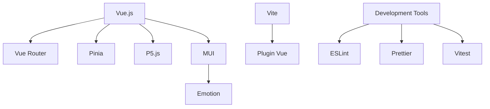

# Tech Context: Vue.js + P5.js Gradient Visualization App

## Technologies Used

### Core Technologies

| Technology | Version | Purpose |
|------------|---------|---------|
| **Vue.js** | 3.x | Primary framework for building the user interface and managing component lifecycle |
| **P5.js** | Latest | Creative coding library for rendering and animating the gradient visualization |
| **Pinia** | Latest | State management for storing and managing gradient and animation settings |
| **Vue Router** | 4.x | Handling navigation and route management (minimal usage in this SPA) |
| **MUI (Material UI)** | Latest | UI component library for consistent design elements |

### Supporting Libraries

| Library | Purpose |
|---------|---------|
| **@vueuse/core** | Utility functions for reactive state handling and window resizing |
| **vue3-perfect-scrollbar** | (Optional) For smooth scrolling inside the drawer |
| **gsap** | (Optional) For additional animation control if needed beyond P5.js |

### Development Tools

| Tool | Purpose |
|------|---------|
| **Vite** | Build tool and development server |
| **ESLint** | Code linting and style enforcement |
| **Prettier** | Code formatting |
| **TypeScript** | (Optional) Type checking and improved developer experience |
| **Vitest** | Unit testing framework |
| **Cypress** | (Optional) End-to-end testing |

## Development Setup

### Prerequisites

- Node.js (v16+)
- npm (v7+) or yarn (v1.22+)
- Modern web browser (Chrome, Firefox, Safari, Edge)
- Code editor (VS Code recommended with Vue extensions)

### Project Initialization

```bash
# Using npm
npm init vue@latest

# Select options:
# - Add TypeScript? (Optional)
# - Add JSX Support? No
# - Add Vue Router? Yes
# - Add Pinia? Yes
# - Add Vitest? Yes
# - Add ESLint? Yes
# - Add Prettier? Yes

cd vue-p5js-gradient-app
npm install
```

### Additional Dependencies Installation

```bash
# Core dependencies
npm install p5 @mui/material @emotion/react @emotion/styled

# Optional utilities
npm install @vueuse/core vue3-perfect-scrollbar gsap
```

### Development Workflow

1. Start development server:
   ```bash
   npm run dev
   ```

2. Build for production:
   ```bash
   npm run build
   ```

3. Preview production build:
   ```bash
   npm run preview
   ```

4. Run tests:
   ```bash
   npm run test
   ```

## Technical Constraints

### Browser Compatibility

- The application targets modern browsers with good support for:
  - ES6+ features
  - CSS Grid and Flexbox
  - Canvas API
  - Web Storage API (for state persistence)

- Minimum browser versions:
  - Chrome 80+
  - Firefox 72+
  - Safari 13.1+
  - Edge 80+

### Performance Considerations

1. **Canvas Performance**:
   - P5.js canvas operations can be CPU-intensive
   - Limit unnecessary redraws
   - Use appropriate frame rates (30-60fps)
   - Consider using `requestAnimationFrame` for optimal timing

2. **State Management**:
   - Watch for deep reactivity issues with complex objects
   - Minimize unnecessary re-renders
   - Use computed properties for derived values

3. **Mobile Considerations**:
   - Touch events instead of mouse events
   - Reduced animation complexity on lower-powered devices
   - Responsive layout adjustments

### Integration Challenges

1. **P5.js and Vue Integration**:
   - P5.js was designed for global scope, not component-based architecture
   - Must properly handle component lifecycle events
   - Canvas resizing needs special attention

2. **Reactive Updates to Canvas**:
   - Ensure P5.js redraws when state changes
   - Balance between responsiveness and performance

3. **UI Performance During Animation**:
   - Drawer animations should remain smooth even during intensive canvas operations
   - Consider using CSS transitions for UI animations to offload from JavaScript

## Dependencies

### Direct Dependencies

```json
{
  "dependencies": {
    "vue": "^3.3.0",
    "vue-router": "^4.2.0",
    "pinia": "^2.1.0",
    "p5": "^1.6.0",
    "@mui/material": "^5.13.0",
    "@emotion/react": "^11.11.0",
    "@emotion/styled": "^11.11.0",
    "@vueuse/core": "^10.1.0"
  },
  "devDependencies": {
    "vite": "^4.3.0",
    "eslint": "^8.40.0",
    "prettier": "^2.8.0",
    "vitest": "^0.31.0",
    "@vitejs/plugin-vue": "^4.2.0"
  }
}
```

### Dependency Relationships



## Build and Deployment

### Build Process

1. Vite bundles the application
2. Assets are optimized and minified
3. Output is generated in the `dist` directory

### Deployment Options

1. **Static Hosting**:
   - GitHub Pages
   - Netlify
   - Vercel
   - AWS S3 + CloudFront

2. **Server Deployment**:
   - Node.js server (Express)
   - Docker container

### Environment Configuration

- Use `.env` files for environment-specific configuration
- Vite handles environment variable injection with `import.meta.env`

## Monitoring and Analytics

- Consider implementing basic analytics to track:
  - User engagement with the visualization
  - Most commonly used color combinations
  - Performance metrics on different devices
